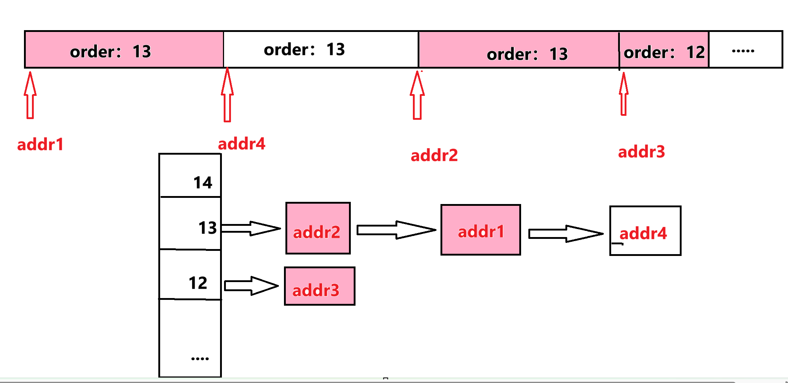

# 实验报告

## 练习 1：理解 First-Fit 连续物理内存分配算法

在First-Fit分配算法中，分配器维护一个自由块列表。当有内存请求时，分配器会从列表中找到第一个足够大的块来满足请求。如果所选的块比请求的大得多，通常会分割该块，并将剩余部分重新放入列表。

### 函数分析
代码分为四个主要部分，分别为：初始化空闲内存、初始化内存块、分配页面、释放页面。
1. **初始化空闲内存**:
   ```c
   free_area_t free_area;

   #define free_list (free_area.free_list)
   #define nr_free (free_area.nr_free)

   static void default_init(void) {
    list_init(&free_list);
    nr_free = 0;
   }
   ```
   default_init 函数用于初始化自由块列表 free_list，并将空闲页数 nr_free 设为 0。free_area_t 数据结构管理自由块列表，包含一个链表 free_list 来存储所有空闲内存块，以及空闲页的数量 nr_free。

2. **初始化内存块**：
   ```c
   static void default_init_memmap(struct Page *base, size_t n) {
    assert(n > 0);
    struct Page *p = base;
    for (; p != base + n; p++) {
        assert(PageReserved(p));
        p->flags = p->property = 0;
        set_page_ref(p, 0);
    }
    base->property = n;
    SetPageProperty(base);
    nr_free += n;
    if (list_empty(&free_list)) {
        list_add(&free_list, &(base->page_link));
    } else {
        list_entry_t* le = &free_list;
        while ((le = list_next(le)) != &free_list) {
            struct Page* page = le2page(le, page_link);
            if (base < page) {
                list_add_before(le, &(base->page_link));
                break;
            } else if (list_next(le) == &free_list) {
                list_add(le, &(base->page_link));
            }
        }
    }
   }

   ```
   default_init_memmap 函数将一段内存初始化为自由块，并将这些块加入自由列表。该函数循环遍历所指定的内存块范围，设置每一块的属性，并根据地址排序插入到 free_list 中。nr_free 记录当前空闲的页面数。用于初始化一个连续的空闲内存块。每个页框的属性都需要进行设置：
   - 第一个页框的 `property` 字段记录了整个块的大小。
   - 其他页框的 `property` 设为 0，并将它们链接到空闲列表中。

3. **分配页面**：
   ```c
   static struct Page *default_alloc_pages(size_t n) {
    assert(n > 0);
    if (n > nr_free) {
        return NULL;
    }
    struct Page *page = NULL;
    list_entry_t *le = &free_list;
    while ((le = list_next(le)) != &free_list) {
        struct Page *p = le2page(le, page_link);
        if (p->property >= n) {
            page = p;
            break;
        }
    }
    if (page != NULL) {
        list_entry_t* prev = list_prev(&(page->page_link));
        list_del(&(page->page_link));
        if (page->property > n) {
            struct Page *p = page + n;
            p->property = page->property - n;
            SetPageProperty(p);
            list_add(prev, &(p->page_link));
        }
        nr_free -= n;
        ClearPageProperty(page);
    }
    return page;
   }

   ```
   default_alloc_pages函数负责根据请求分配页面。它遍历自由块列表，找到第一个足够大的块。
   找到合适的块后，如果该块比请求的大小大，则将其分割并将剩余部分重新加入自由列表。更新空闲页面的数量nr_free。

4. **default_free_pages**：
   ```c
   static void default_free_pages(struct Page *base, size_t n) {
    assert(n > 0);
    struct Page *p = base;
    for (; p != base + n; p++) {
        assert(!PageReserved(p) && !PageProperty(p));
        p->flags = p->property = 0;
        set_page_ref(p, 0);
    }
    base->property = n;
    SetPageProperty(base);
    nr_free += n;
    list_entry_t *le = &free_list;
    while ((le = list_next(le)) != &free_list) {
        struct Page *p = le2page(le, page_link);
        if (base + n == p) {
            base->property += p->property;
            list_del(le);
        }
        else if (p + p->property == base) {
            p->property += base->property;
            base = p;
        }
    }
    list_add_before(&free_list, &(base->page_link));
   }
   ```
   default_free_pages 函数将指定的页面释放回空闲块列表。函数通过合并相邻的空闲块来减少碎片，并将释放后的块添加到自由列表中。

### 物理内存分配过程
当系统需要分配物理内存时，`default_alloc_pages` 函数会按照 First-Fit 策略查找第一个满足条件的内存块。找到后进行分配，若剩余空间足够大则拆分。释放内存时，`default_free_pages` 会尝试合并相邻的空闲块，减少内存碎片。

|0x80000000|--openSBI --|0x80200000|--kernel映像--|0x80205000|--page结构体--|0x8020f318|--可分配的页资源--|0x88000000|


### 改进空间
First-Fit 算法容易导致内存碎片问题，随着时间推移，空闲内存块分布越来越不连续，可能导致内存利用率下降。可以尝试引入内存压缩或更复杂的内存分配算法（如 Best-Fit 或 Worst-Fit）来优化碎片问题。


##  练习2：Best-Fit连续物理内存分配算法实现及深入分析

在本练习中，任务是基于 `kern/mm/default_pmm.c` 中 First-Fit 算法的实现，设计并实现 Best-Fit 连续物理内存分配算法。Best-Fit 算法需要找到**最小且满足需求的连续内存块**，这与First-Fit 算法（从链表头部开始，找到第一个满足条件的内存块）不同。

Best-Fit 算法的核心思想是，在空闲内存块链表中找到最接近所需大小的内存块，以减少内存碎片的产生。下面我们对代码进行详细分析。

### 1. Best-Fit 算法流程概述

#### (1) 内存块初始化：`best_fit_init_memmap`

内存分配首先需要初始化内存块 (`Page` 结构体)，函数 `best_fit_init_memmap` 用于将连续的物理内存页面初始化为空闲状态，并加入到空闲链表中。这是分配算法的基础。

##### 关键步骤：

* **属性设置**：每个页面都被标记为空闲，且 `property` 字段表示该内存块包含的连续空闲页面的数量。
* **空闲链表管理**：空闲链表的维护是核心，Best-Fit 需要保证链表中每个空闲内存块按照地址从低到高排序。在加入空闲链表时，函数会查找链表中第一个地址大于 `base` 的页面，并将新页块插入该位置。

**代码片段：**

```c
if (base < page) {
    list_add_before(le, &(base->page_link));
    break;
} else if (list_next(le) == &free_list) {
    list_add(le, &(base->page_link));
}
```

**分析**：此段代码负责将 `base`（新的空闲块）按地址顺序插入空闲链表，保证链表顺序正确，为后续的 Best-Fit 搜索提供便利。

#### (2) 分配内存页面：`best_fit_alloc_pages`

该函数实现了 Best-Fit 算法的核心逻辑，即在空闲链表中寻找最适合的内存块来满足分配请求。

##### 关键步骤：

* **遍历空闲链表**：通过 `list_next(le)` 遍历空闲内存块链表，找到最小且大于等于 `n` 个页面的空闲块。
* **最小块查找**：在遍历过程中记录满足条件的最小块，避免直接分配第一个符合条件的块，从而减少内存碎片。

**代码片段：**

```c
while ((le = list_next(le)) != &free_list) {
    struct Page *p = le2page(le, page_link);
    if (p->property >= n && p->property < min_size) {
        t = p;
        min_size = p->property;
    }
}
```

**分析**：该循环遍历整个链表，寻找能满足请求的最小块。`min_size` 初始设置为 `nr_free + 1`，表示尚未找到合适的块。每次找到符合条件的块时，将 `min_size` 更新为该块大小，并将 `t` 指向该块。

* **分配页面**：一旦找到最合适的块，将其从链表中移除。如果空闲块比请求的页数多，则需要将剩余的部分重新插入空闲链表。

**代码片段：**

```c
if (page->property > n) {
    struct Page *p = page + n;
    p->property = page->property - n;
    SetPageProperty(p);
    list_add(prev, &(p->page_link));
}
```

**分析**：如果当前找到的块比需要的页面多，则将剩余部分重新插入链表。这样做能够防止浪费多余的页面，维持内存利用率。

#### (3) 释放内存页面：`best_fit_free_pages`

该函数实现了内存块的释放逻辑，将被释放的页面重新加入空闲链表，并尝试与相邻的空闲块合并，以减少内存碎片。

##### 关键步骤：

* **链表插入**：和初始化时一样，在释放时需要将内存块按地址顺序插入空闲链表中。
  
* **合并相邻块**：释放页面后，检查释放的块是否与前后相邻的块连续。如果是，则合并它们，以减少链表中小块的碎片化问题。
  

**代码片段：**
```c
static void best_fit_free_pages(struct Page *base, size_t n) {
    struct Page *p = base;
    for (size_t i = 0; i < n; i++, p++) {
        assert(!PageReserved(p) && !p->property);
        p->flags = 0;
        set_page_ref(p, 0);
    }
    base->property = n;
    nr_free += n;
    list_entry_t *le = &free_list;
    list_entry_t *head = le;
    list_entry_t *next;
    while ((next = list_next(le)) != head) {
        if (le2page(next, page_link) > base) {
            break;
        }
        le = next;
    }
    list_add_before(le, &(base->page_link));
}
```

**分析：**

* **遍历释放的页块**：清除页块的标志位，并将其引用计数器重置为 0。
* **更新页块属性**：将该页块的 `property` 设置为所释放页块的数量 `n`。
* **插入空闲链表**：将释放的页块插入到 `free_list` 中，保持链表的物理地址顺序。

释放操作将已分配的页块重新标记为空闲状态，并将其插回到空闲页块链表中。


#### (4) 查看空闲页数：`best_fit_nr_free_pages`

```c
static size_t best_fit_nr_free_pages(void) {
    return nr_free;
}
```

**分析：**

* 返回全局变量 `nr_free`，即当前系统中空闲页块的数量。

该函数简单地返回当前的空闲页块数量，用于监控内存的使用情况。

* * *


### 2. Best-Fit 算法的优缺点分析

#### 优点：

* **减少内存碎片**：与 First-Fit 相比，Best-Fit 能更有效地减少内存碎片，因为它总是选择最小的满足需求的块。
* **较高的内存利用率**：通过合并相邻块并确保分配最小合适块，Best-Fit 能够提高内存的利用率。

#### 缺点：

* **搜索复杂度较高**：Best-Fit 需要遍历整个空闲链表来寻找最合适的块，因此在分配内存时的时间复杂度相对较高，尤其在空闲块较多时表现较差。
* **合并操作的开销**：内存释放时的合并操作也会带来一定的开销，尤其是在频繁分配和释放时。

### 3. 算法改进空间

虽然 Best-Fit 能够减少内存碎片，但它在实际使用中也有改进的空间：

* **链表优化**：可以考虑使用更复杂的数据结构（如平衡二叉树或堆）来管理空闲块，以提高分配和合并操作的效率。这样可以避免遍历链表的开销，从而减少搜索的时间复杂度。
* **快速分配策略**：可以引入快速分配的策略，例如为常见的块大小设置特定的链表，从而减少搜索时间。


## Challenge：buddy system（伙伴系统）分配算法

Buddy System算法把系统中的可用存储空间划分为存储块(Block)来进行管理（分配和回收）, 每个存储块的大小必须是2的n次幂(Pow(2, n)), 即1, 2, 4, 8, 16, 32, 64, 128...

### 1、Buddy System的设计思想

#### （1）内存块初始化

`buddy_init_memmap()` 函数在系统初始化时，划分内存空间并按 2 的幂次分级存入各自的空闲链表中。具体步骤为：

- **地址获取与初始化**：初始化时，利用 `page2pa` 函数获取内存块的首地址，并根据**内存大小逐级划分**（比如：先对内存取小于内存的最大二次幂，再对剩余的内存进行同样处理，直至处理完所有内存）。

- **链表管理**：每个空闲块按 `order`（即块的大小等级，也就是内存大小对应2的指数）加入到 `free_list[order]` 链表中，同时更新空闲块数量 `nr_free[order]`。

  划分图示如下：
  
  

#### （2）内存分配

在进行内存分配时，通过 `buddy_alloc_pages(size_t n)` 函数完成。该功能的主要思想为：

- **向上取整**：通过 `round_up` 函数获取所需大小的 `order`，并确保分配的内存块大小不小于请求大小。

- **块查找**：在 `free_list` 中查找满足需求的块。若 `free_list[order]` 无法提供足够的块，将检查更大的块，并通过逐步切割获得适当大小。

- **切割**：当找到的块大于所需大小时，将其不断向下切割，直到达到需求大小。每次切割生成的空闲块将重新加入 `free_list`，方便下次分配。

- **属性设置**：分配成功后，设置块属性并标记为已使用。

  划分图示：（着色部分为已分配，图示为已经分配一个13order和12order的块后，再申请一个13order的块，此时需要将order为14的块分割，order13的两个块并连入链表，order14的块从链表中删除）

  
  
  #### （3）内存释放
  
  当释放内存块时，通过 `buddy_free_pages(struct Page *base, size_t n)` 函数实现。该功能逻辑如下：
  
  - **伙伴查找**：释放内存时，首先通过计算当前块的左、右伙伴地址，判断是否可以与左、右伙伴块合并。
  - **合并检查**：若左、右伙伴块与当前块的大小相同且位于空闲状态，则可进行合并操作，将两个块视为一个更大的块并继续向上合并。该过程一直进行，直到不能继续合并为止。
  - **属性更新**：释放并合并完成后，将最终的内存块重新加入 `free_list` 中，将被合并的块删除并更新空闲块计数。

### 2、Buddy System的具体实现

#### （1）内存管理

```c++
typedef struct {
    list_entry_t free_list[Max_Order + 1];//管理内存块
    unsigned int nr_free[Max_Order + 1];//内存块数量
} BuddySystem;

```


#### （2）内存初始化

```c++
static void buddy_init_memmap(struct Page *base, size_t n) {
  uintptr_t begin_addr = page2pa(base);//获取首地址 page转换地址
  //核心：将非2次幂的数据划分成小块的2的次幂
  cprintf("构建buddy_system前:\n");
  print_buddy();
  while(n){
    
    int order=0;
    size_t order_size;//每一个order有多少页
    order=round_down(n);
    cprintf("order:%d\n",order);
    order_size=1u<<order;
      
    struct Page* p = pa2page(begin_addr);//设置起始地址
    p->property = order;//
    SetPageProperty(p);
  
   cprintf("Adding page at %p to free_list[%d]\n", p, order);
   list_add(&free_list[order],&p->page_link);//这里的free——list编号从下到上编号 8页对应3
   nr_free[order]++;
   begin_addr+=order_size*PGSIZE;
   n-=order_size;
  }
  cprintf("构建buddy_system后:\n");
  print_buddy();
}
```

#### （3）内存分配

```c++
 static struct Page *buddy_alloc_pages(size_t n) {
    size_t need_order = round_up(n); // 向上取整，得到需要的order
    // 找到适合的空闲块
    for (size_t order = need_order; order <= Max_Order; order++) {
      cprintf("order：%d\n",order);
        if (nr_free[order] > 0) {// 如果找到了合适的空闲块，进行分配
            list_entry_t *le = list_next(&free_list[order]);
            list_del(le);
            nr_free[order]--;
            struct Page *allocated_page = le2page(le, page_link);   //链表条目获取page
            allocated_page->property = order; // 设置属性
            SetPageProperty(allocated_page);
            // 如果找到的块比需要的块大，进行切割
            while (order > need_order) {
                order--; // 将order减小，准备切割
                struct Page *remaining_page = allocated_page + (1 << order); 
                // 更新剩余页面的属性
                remaining_page->property = order; 
                SetPageProperty(remaining_page);
                 allocated_page->property = order; // 设置属性
                  SetPageProperty(allocated_page);
                // 将剩余页面添加到链表中
                list_add(&free_list[order], &remaining_page->page_link);
                nr_free[order]++;
            }

            cprintf("buddy_system:\n");
            print_buddy();
            return allocated_page; // 返回分配的页面
        }
    }
    cprintf("No block!\n");
    return NULL; // 没有找到合适的块
}
```

#### (4)内存释放

```c++
static void buddy_free_pages(struct Page *base, size_t n) {
    size_t order = base->property;  // 获取当前块的 order
    uintptr_t base_addr = page2pa(base);  // 获取当前块的物理地址
    struct Page *buddy_page = NULL;  // 伙伴页
    while (order <= Max_Order) {
        // 计算左侧和右侧伙伴地址
        uintptr_t left_buddy_addr = base_addr - (1 << order);
        uintptr_t right_buddy_addr = base_addr + (1 << order);
        struct Page *left_buddy_page = pa2page(left_buddy_addr);
        struct Page *right_buddy_page = pa2page(right_buddy_addr); 		       
        int merged = 0;  // 标记是否发生了合并
        //合并左侧伙伴  
        if ( left_buddy_addr >= 0x80200000 && // 确保左侧伙伴在有效内存范围内
            left_buddy_page->property == order && 
            PageProperty(left_buddy_page)&&//该页是否自由
            nr_free[order]) {
            // 左侧伙伴块可合并
            list_del(&left_buddy_page->page_link);
            nr_free[order]--;
            base = left_buddy_page;  // 合并后，base 指向较小地址的块
            base_addr = left_buddy_addr;
            merged = 1;
        }
        // 如果左侧伙伴不可合并，尝试合并右侧伙伴   
        else if ( right_buddy_addr < 0x88000000 && // 确保右侧伙伴在有效内存范围内
                 right_buddy_page->property == order && 
                  PageProperty(right_buddy_page)&&
                  nr_free[order]) {
            list_del(&right_buddy_page->page_link);
            nr_free[order]--; // base 不变，仍指向当前块（较小地址的块）
            merged = 1;
        }
        // 如果发生了合并，增加块的 order，继续递归检查合并后的块
        if (merged) {
            base->property++;
            order = base->property;
        } else {
            // 无法再合并，跳出循环
            break;
        }
    }    // 合并完成后，将块加入对应 order 的 free_list
    SetPageProperty(base);
    list_add(&free_list[base->property], &base->page_link);
    nr_free[base->property]++;
}
```


### 3、Buddy System的正确性证明

#### （1）验证函数

```c++
static void basic_check(void) {
    struct Page *p0, *p1, *p2;
    assert((p0 = alloc_pages(1)) && (p1 = alloc_pages(3)) && (p2 = alloc_pages(5)));
    free_pages(p0,1);
    free_pages(p2,5);

    assert((p0 = alloc_pages(4)) && (p2 = alloc_pages(3)));
    free_pages(p0, 4);
    free_pages(p1, 3);

    assert((p0 = alloc_pages(9)));
    free_pages(p0, 9);
    free_pages(p2, 3);
    
}
```

#### （2）正确性

以下操作均为连续

* 初始化内存分配的块有：

  

  

* 分配

  首先分配一块order为0的块 ，如下图左，可正常分配；再分配一块order为2的，需要将order为3的分割，如下图右正常分割。

  | 分配一块order为0                                             | 分配一块order为2                                             |
  | ------------------------------------------------------------ | ------------------------------------------------------------ |
  |  |  |

  

  

* 释放

  释放order为1的块时，无可合并，直接并入相应链表。释放order为3的块时，可以合并，最终合并入order为4的块，连入相应链表
  
  | 合并大小为1的块                                              | 合并大小为3的块                                              |
| ------------------------------------------------------------ | ------------------------------------------------------------ |
  |  |  |
  

* assert断言

  验证函数中的assert断言全部通过！

