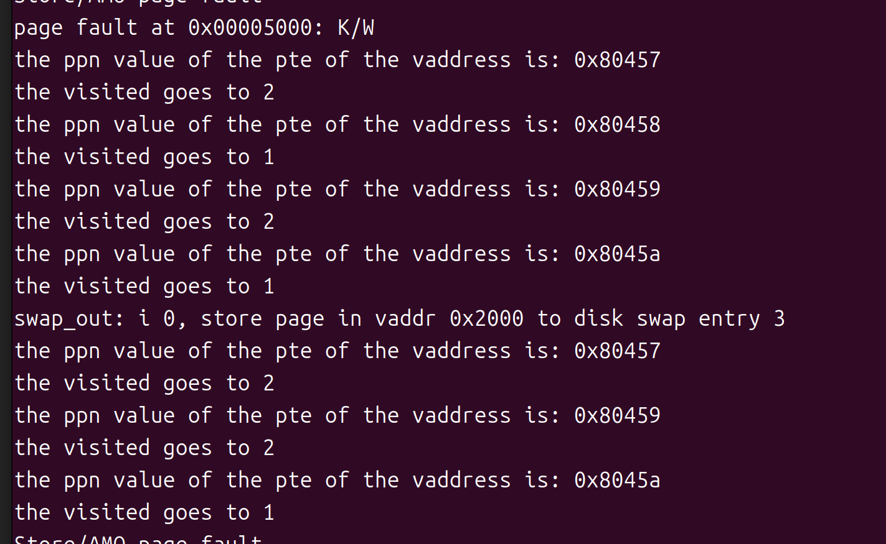
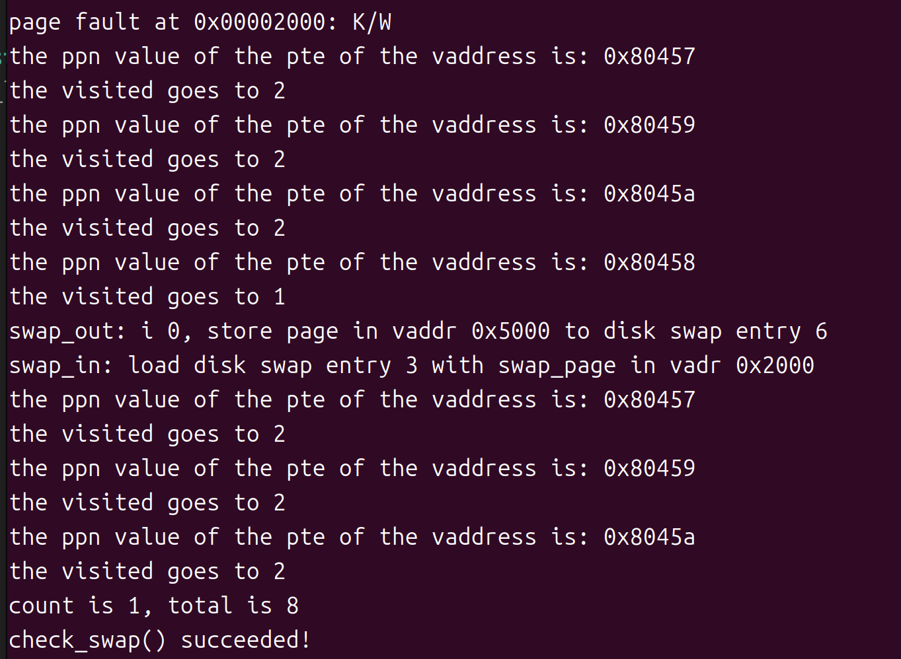

# uCore 实验报告：lab3

## 练习 3：给未被映射的地址映射上物理页

### 任务概述

本练习的目标是实现 `do_pgfault` 函数，处理页面错误并将未映射的虚拟地址映射到物理页。为了实现这一目标，我们需要根据虚拟内存区域（VMA）设置正确的访问权限，并且根据页表和内存控制结构进行操作。特别需要注意的是，我们必须操作指定的页表，而不是内核的页表。

### 实现过程

1. **查找虚拟内存区域**：
   首先，我们需要根据错误地址查找包含该地址的虚拟内存区域（VMA）。如果无法找到该地址或者该地址无效，返回错误。

2. **确定页面权限**：
   根据 VMA 的标志位（vm_flags ,若等于宏定义VM_WRITE则为可写权限），设置页面的访问权限。如果 VMA 是可写的，则该页面需要同时具备读写权限。否则，只需设置为只读权限。

3. **查找页表项**：
   获取页表项（PTE），如果该地址映射的页面不存在，则分配一个新的物理页面并建立映射。如果页面已经存在，则需要处理可能的交换操作，从交换区加载该页面到内存中。

4. **操作页面和页表**：
   - 如果页表项为空（表示该虚拟地址没有映射到物理页面），则需要分配新的物理页面并将其映射到该地址。
   - 如果该页面已经存在于内存中，但需要从交换区恢复，则使用 `swap_in` 将页面加载到内存中，并通过 `page_insert` 函数将其插入到页表。

### `do_pgfault` 实现代码

```c
int do_pgfault(struct mm_struct *mm, uint_t error_code, uintptr_t addr) {
    int ret = -E_INVAL;
    struct vma_struct *vma = find_vma(mm, addr); // 查找包含错误地址的VMA
    pgfault_num++;
    
    if (vma == NULL || vma->vm_start > addr) { // 地址无效
        cprintf("not valid addr %x, and  can not find it in vma\n", addr);
        goto failed;
    }
    
    uint32_t perm = PTE_U;
    if (vma->vm_flags & VM_WRITE) { // 设置页面权限
        perm |= (PTE_R | PTE_W);
    }
    
    addr = ROUNDDOWN(addr, PGSIZE); // 对齐到页面边界
    ret = -E_NO_MEM;
    pte_t *ptep = get_pte(mm->pgdir, addr, 1); // 获取页表项
    
    if (*ptep == 0) { // 页面不存在：分配新的页面
        if (pgdir_alloc_page(mm->pgdir, addr, perm) == NULL) {
            cprintf("pgdir_alloc_page in do_pgfault failed\n");
            goto failed;
        }
    } else { // 页面已存在：可能需要从交换区加载
        if (swap_init_ok) {
            struct Page *page = NULL;
            swap_in(mm, addr, &page); // 从交换区加载页面
            page_insert(mm->pgdir, page, addr, perm); // 在页表中插入映射
            swap_map_swappable(mm, addr, page, 1); // 将该内存页设置为可交换
            page->pra_vaddr = addr; // 保存虚拟地址
        } else {
            cprintf("no swap_init_ok but ptep is %x, failed\n", *ptep);
            goto failed;
        }
    }
    ret = 0;
failed:
    return ret;
}
```

### 设计实现过程

1. **查找虚拟内存区域**：`find_vma` 函数查找包含给定地址的 VMA。通过 VMA，我们可以确定地址的有效性和所需的访问权限。
2. **设置页面权限**：根据 VMA 中的标志位设置页面的访问权限。若是可写（`VM_WRITE`），则权限设置为可读写。
3. **处理页表**：通过 `get_pte` 获取页表项，检查该虚拟地址是否已经映射到物理页。若未映射，则调用 `pgdir_alloc_page` 分配新的物理页。
4. **交换操作**：如果页面已存在但需要从交换区加载，则通过 `swap_in` 将其加载到内存，并更新页表。

### 问题解答

1. **页目录项（PDE）和页表项（PTE）的作用**：
   - **PDE** 和 **PTE** 是管理虚拟地址空间的核心数据结构，分别用于表示虚拟内存区域的页目录和页表的映射。PDE 负责管理更大粒度的内存区域，而 PTE 则直接映射具体的物理页。
   - 对于页替换算法（如 Clock 算法），PDE 和 PTE 的信息（如访问权限、页状态等）可以帮助决定是否需要换出某个页面。

2. **缺页异常时硬件的处理**：
   当执行缺页异常时，硬件首先会产生一个页面访问异常，然后 CPU 会跳转到操作系统提供的缺页处理例程（如 `do_pgfault`）。硬件会提供错误码和错误地址，操作系统根据这些信息决定是否分配新的物理页面或从交换区加载页面。

3. **Page 数据结构与页表项的关系**：
   - `Page` 数据结构是 uCore 管理物理页的基础，通常以数组形式存在，每个 `Page` 代表一个物理页面。
   - 页目录项和页表项指向具体的物理页，它们通过映射关系与 `Page` 数据结构中的项对应。具体来说，页表项（PTE）中的物理页地址指向 `Page` 数据结构中的具体项。

## 练习 4：Clock 页替换算法

### 任务概述

在本练习中，我们将实现 Clock 页替换算法。Clock 算法是一种基于访问位（即 `visited` 标志位）管理页面替换的算法。与 FIFO 算法相比，Clock 算法具有更好的性能，因为它能够有效地识别未被访问的页面，从而进行替换。

### 实现思路

Clock 页替换算法通过维护一个循环链表，模拟时钟的指针，在页面链表中遍历，查找访问位为 0 的页面进行替换。每次访问页面时，将其访问位设置为 1，表示该页面已被访问。Clock 算法通过指针遍历链表，直到找到一个访问位为 0 的页面，然后将其换出。

### 代码实现

#### 1. 初始化 Clock 算法数据结构

```c
static int _clock_init_mm(struct mm_struct *mm)
{
    list_init(&pra_list_head); // 初始化页面链表
    curr_ptr = &pra_list_head; // 初始化当前指针
    mm->sm_priv = &pra_list_head; // 设置私有成员指针
    return 0;
}
```

#### 2. 将页面插入交换区

```c
static int _clock_map_swappable(struct mm_struct *mm, uintptr_t addr, struct Page *page, int swap_in)
{
    list_entry_t *entry = &(page->pra_page_link); // 获取页面链表项
    list_entry_t *head = (list_entry_t *)mm->sm_priv; // 获取链表头
    list_add_before(head, entry); // 将页面插入链表头
    page->visited = 1; // 设置访问位为 1
    return 0;
}
```

#### 3. 页面换出策略

```c
static int _clock_swap_out_victim(struct mm_struct *mm, struct Page **ptr_page, int in_tick)
{
    list_entry_t *head = (list_entry_t *)mm->sm_priv;
    while (1) {
        curr_ptr = list_next(curr_ptr); // 遍历链表
        if (curr_ptr == head) {
            curr_ptr = list_next(curr_ptr); // 遇到头部时跳过
            if (curr_ptr == head) {
                *ptr_page = NULL; // 链表为空，返回 NULL
                break;
            }
        }
        struct Page *page = le2page(curr_ptr, pra_page_link);
        if (page->visited == 0) { // 找到未访问的页面
            *ptr_page = page;
            list_del(curr_ptr); // 删除该页面
            break;
        } else {
            page->visited = 0; // 重置访问位
        }
    }
    return 0;
}
```
### 设计实现过程

1. **初始化函数 (`_clock_init_mm`)**：
    
    * 初始化一个链表 `pra_list_head` 用于存储页面，`curr_ptr` 指向链表头。
    * 将 `mm->sm_priv` 设置为链表头的地址，供后续的替换算法操作使用。
2. **将页面标记为可交换 (`_clock_map_swappable`)**：
    
    * 将页面插入到链表头部，并将页面的访问位设置为 1，表示该页面已被访问。
3. **选择被替换的页面 (`_clock_swap_out_victim`)**：
    
    * 遍历链表，查找访问位为 0 的页面。如果页面被访问过，则将其访问位重置为 0。直到找到一个未被访问的页面，并将其从链表中删除。

### 问题回答

1. **Clock 与 FIFO 算法的不同**：
    
    * FIFO 算法基于页面进入内存的顺序来替换页面，简单但不考虑页面的使用频率。
    * Clock 算法通过访问位来动态判断哪些页面需要替换，更能反映页面的实际使用情况。相较于 FIFO，Clock 算法能有效减少不必要的页面替换，提高性能。
2. **Clock 算法的核心思想**：
    
    * Clock 算法通过一个指针 (`curr_ptr`) 在双向链表上循环遍历，检查每个页面的访问位。如果页面的访问位为 0，则将其替换，否则将访问位重置为 0，并继续遍历。Clock 算法是一种基于**访问位**的改进型页面替换算法。它是**FIFO**算法的改进，试图在页面替换过程中考虑页面的使用情况，从而降低页面替换的代价。Clock 算法常常被用于操作系统的虚拟内存管理中，尤其是在内存受限的环境下，它通过简化页面替换过程来提高性能。
Clock 算法通常使用一个**循环链表**来管理所有的页面。每个页面都包含一个**访问位**（通常是 1 或 0）和一个指向下一个页面的指针。指针（或叫“时钟指针”）指向链表中的某个页面，类似于时钟的指针不断旋转。访问位（visited）表示页面是否被访问过。访问位为 1 表示该页面最近被访问过，0 表示该页面最近没有被访问。Clock算法通过一个指针（curr_ptr）在循环链表上进行“钟表旋转”。在每一次页面替换时，curr_ptr 会检查指向页面的访问位：如果访问位为 0：该页面是候选页面，可以被替换。将这个页面从链表中移除，并替换为新的页面。如果访问位为 1：该页面在最近的操作中已经被访问过，因此 不进行替换。此时会将页面的访问位重置为 0，并移动指针，继续检查下一个页面。


## 练习5：阅读代码和实现手册，理解页表映射方式相关知识（思考题）
如果我们采用”一个大页“ 的页表映射方式，相比分级页表，有什么好处、优势，有什么坏处、风险？

**答：**

一个大页表：

* 优点：
  * 维护简单，只用维护一个页表。
  * 当虚拟空间小时，访问速度较块，便捷。只需访问一个页表
* 缺点：
  * TLB缓存频繁缺失。 TLB缓存有限，虚拟空间很大，会导致一级页表较大，导致TLB无法缓存最近使用的所有页表项，缓存页表项数目少，导致命中概率降低，查询转换速率降低。
  * 虚拟空间较大时，会使得一级页表很大，页表项数增多，消耗的内存也多。如果页表项是以线性表的形式存储 ，还会导致访问时间增多。
  * TLB失效代价大：单级页表完全依赖于页表的结构，一旦TLB失效，访问内存时需要读取庞大的页表，增加了内存访问延迟。
  * 不适合稀疏地址空间。如果地址空间是稀疏的，单级页表需要为未使用的地址区域分配映射表项，导致大量无意义的内存消耗。

多级页表：

* 优点：
  * 适用于大内存空间 。通过引入多级页表，可以将页表项分散到多个页表中存储，减少了内存的开销，内存呢利用率较高。
  * 多级页表具有一定的灵活性。可以根据虚拟空间的大小设计页表的级数。
  * 对于稀疏的虚拟地址空间，多级页表的存储方式更加节约内存。
* 缺点：
  * 多级页表实现的MMU较为复杂。需要维护多个页表。
  * 随着页表级数增多，当出现TLBMiss的时候，访问内存的次数会增多，时间开销较大。这种方式一定程度上体现了时间换空间的思想。

## 扩展练习 Challenge：实现不考虑实现开销和效率的LRU页替换算法（需要编程）
需写出有详细的设计、分析和测试的实验报告。完成出色的可获得适当加分。
#### 算法思路：

* 最久未使用(LRU)算法：

  利用局部性，通过过去的访问情况预测未来的访问情况，我们可以认为最近还被访问过的页面将来被访问的可能性大，而很久没访问过的页面将来不太可能被访问。于是我们比较当前内存里的页面最近一次被访问的时间，把上一次访问时间离现在最久的页面置换出去。

* 实现思路：

  在page的结构体中维护一个visited的变量，同时增加一个check函数更新每个页表的访问次数（即visited），check函数的主要功能是更新现有页表项的访问次数。维护周期为发生page fault的时候，即每次发生缺页时，都会更新每个页的访问情况，在这个发生缺页的周期里无论页表被访问多少次在visited变量上都只体现加1，这是由于我们获取页表访问情况只能通过标志位PTE_A。

  每次check都会找到最少访问的page作为least_visited_page，作为即将被换出的页。如果现存的页表访问次数均相同则会选择页表链表中靠前的页表作为east_visited_page，“靠前”也意味着这个页表换入的时间较早。

  受限于无法准确获取页表访问情况，只能采取这种近似于估算的方法来判断哪个页表最久未使用。

#### 具体代码实现

*  _lru_check函数

  ```c++
  static int _lru_check(struct mm_struct *mm)
  {
      list_entry_t *head = (list_entry_t *)mm->sm_priv;   //头指针
      assert(head != NULL);
      list_entry_t *entry = head;
      struct Page *first_page = le2page(entry, pra_page_link);
      least_visited_page=first_page;//将最久未访问的页设置成第一个页
      while ((entry = list_prev(entry)) != head)
      {
          //获取page
          struct Page *entry_page = le2page(entry, pra_page_link);
          //获取页表项
          pte_t *tmp_pte = get_pte(mm->pgdir, entry_page->pra_vaddr, 0);
          cprintf("the ppn value of the pte of the vaddress is: 0x%x  \n", (*tmp_pte) >> 10);
          if (*tmp_pte & PTE_A)  //如果近期被访问过，visited++
          {
              entry_page->visited ++;
              *tmp_pte = *tmp_pte ^ PTE_A;//清除访问位
          }
  
          if(entry_page->visited<least_visited_page->visited){//更新最久未访问的页
              least_visited_page=entry_page;
          }
         
          cprintf("the visited goes to %d\n", entry_page->visited);
      }
  }
  ```

该函数目的主要是更新页表项的访问情况，并找出最久未访问的那个页表项。

* _lru_map_swappable函数

  ```c++
  static int
  _lru_map_swappable(struct mm_struct *mm, uintptr_t addr, struct Page *page, int swap_in)
  {
      _lru_check(mm);
       list_entry_t *head=(list_entry_t*) mm->sm_priv;
      list_entry_t *entry=&(page->pra_page_link);
   
      assert(entry != NULL && head != NULL);
      page->visited=0;
      list_add(head, entry);
      return 0;
  }
  
  ```

  该函数主要是将新页表链接到mm管理器的链表中，并初始化visited位。同时更新新页表插入前的访问情况

* _lru_swap_out_victim函数

  ```c++
  static int
  _lru_swap_out_victim(struct mm_struct *mm, struct Page ** ptr_page, int in_tick)
  {
      _lru_check(mm);//更新访问情况找到换出的页表。
       list_entry_t *head=(list_entry_t*) mm->sm_priv;
          assert(head != NULL);
       assert(in_tick==0);
       list_entry_t *least_page_link=&(least_visited_page->pra_page_link);
      if (least_page_link!= head) {//
          list_del(least_page_link);
          *ptr_page =least_visited_page;
      } else {
          *ptr_page = NULL;
      }
      return 0;
  }
  ```

  该函数主要是找到即将换出的页表，更新为ptr_page。

#### 检测函数

* 函数设计

  ```c++
  static int 
  _lru_check_swap(void) {
      /*在此之前，共发生0x1000、0x2000、0x3000、0x4000共四次缺页*/
      *(unsigned char *)0x3000 = 0x0c;
      assert(pgfault_num==4);
      *(unsigned char *)0x1000 = 0x0a;
      assert(pgfault_num==4);
      *(unsigned char *)0x5000 = 0x0e;
      assert(pgfault_num==5);
       *(unsigned char *)0x4000 = 0x0d;
      assert(pgfault_num==5);
       *(unsigned char *)0x3000 = 0x0c;
      assert(pgfault_num==5);
      *(unsigned char *)0x2000 = 0x0b;
      assert(pgfault_num==6);
      return 0;
  }
  ```

  在第八行发生缺页时，0x1000和0x3000会各自增加一次visited，这时候可供换出的是0x2000和0x4000，但因为0x2000在链表中的位置更靠前，访问的时间更早所以换出0x2000. 

  第八行之后访问0x4000和0x3000均访问成功，第14行访问0x2000时检测0X2000的页是否被换出，如果之前成功换出所以会发生缺页，

* 运行情况及正确性证明：

  * 第8行缺页时的运行情况

    0X80458对应的就是页表虚拟地址为0X2000的位置，在swap—out语句看到其被换出，swap_out语句下是换入0X5000之前页表项的情况。

  * 检查0x2000是否成功换出

    

    在0X2000处发生缺页，说明之前的第8行的缺页成功换出。至此，lru置换算法检查结束，该算法实现能够正常换出最久未访问的页！说明算法实现正确！
