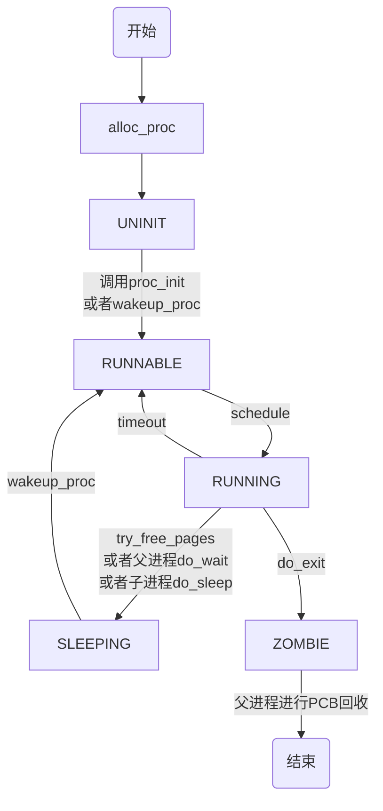


# 练习3：阅读分析源代码，理解进程执行 fork/exec/wait/exit 的实现，以及系统调用的实现（不需要编码）
请在实验报告中简要说明你对 fork/exec/wait/exit函数的分析。并回答如下问题：
  - 请分析fork/exec/wait/exit的执行流程。重点关注哪些操作是在用户态完成，哪些是在内核态完成？内核态与用户态程序是如何交错执行的？内核态执行结果是如何返回给用户程序的？
  - 请给出ucore中一个用户态进程的执行状态生命周期图（包执行状态，执行状态之间的变换关系，以及产生变换的事件或函数调用）。（字符方式画即可）

## 1.分析fork/exec/wait/exit的执行流程

### 1. fork 执行流程

- **用户态**：进程调用 `do_fork()` 函数，这是在用户态下完成的。会创建一个新的进程控制块（PCB），并复制父进程的地址空间、寄存器状态等。
- **返回**：如果 `fork()` 成功，父进程会得到子进程的PID，而子进程会得到0。这个返回值是在内核态设置的，然后通过系统调用返回给用户态。
```cpp
/*************************************************************
process relations
parent:           proc->parent  (proc is children)
children:         proc->cptr    (proc is parent)
older sibling:    proc->optr    (proc is younger sibling)
younger sibling:  proc->yptr    (proc is older sibling)
*************************************************************/
// set_links - set the relation links of process
static void set_links(struct proc_struct *proc) {
    list_add(&proc_list, &(proc->list_link));
    proc->yptr = NULL;
    if ((proc->optr = proc->parent->cptr) != NULL)
        proc->optr->yptr = proc;
    proc->parent->cptr = proc;
    nr_process ++;
}
```
在lab5里使用set_links(proc)函数来设置进程间的关系，cptr指针指向当前进程的子进程中最新创建的子进程，yptr指向与当前进程共享同一个父进程，但比当前进程的创建时间更新的下一个进程，optr指针指向与当前进程共享同一个父进程，但比当前进程的创建时间更早的上一个进程。
同时，在lab4里并未实现copy_mm,lab5中实现了：
```cpp

// copy_mm - process "proc" duplicate OR share process "current"'s mm according clone_flags
//         - if clone_flags & CLONE_VM, then "share" ; else "duplicate"
static int
copy_mm(uint32_t clone_flags, struct proc_struct *proc) {
    struct mm_struct *mm, *oldmm = current->mm;

    /* current is a kernel thread */
    if (oldmm == NULL) {
        return 0;
    }
    if (clone_flags & CLONE_VM) {
        mm = oldmm;
        goto good_mm;
    }
    int ret = -E_NO_MEM;
    if ((mm = mm_create()) == NULL) {
        goto bad_mm;
    }
    if (setup_pgdir(mm) != 0) {
        goto bad_pgdir_cleanup_mm;
    }
    lock_mm(oldmm);
    {
        ret = dup_mmap(mm, oldmm);
    }
    unlock_mm(oldmm);

    if (ret != 0) {
        goto bad_dup_cleanup_mmap;
    }

good_mm:
    mm_count_inc(mm);
    proc->mm = mm;
    proc->cr3 = PADDR(mm->pgdir);
    return 0;
bad_dup_cleanup_mmap:
    exit_mmap(mm);
    put_pgdir(mm);
bad_pgdir_cleanup_mm:
    mm_destroy(mm);
bad_mm:
    return ret;
}

```
它处理了两个主要的内存管理任务：当创建一个新进程时，决定是复制当前进程的内存映射（mm），还是与当前进程共享相同的内存映射。这取决于传递给函数的 clone_flags 参数。如果当前进程是一个内核线程（没有用户态内存，即 oldmm 为 NULL），则不需要复制或共享内存，直接返回0。
如果 clone_flags 包含 CLONE_VM 标志，表示新进程应该与当前进程共享内存映射。在这种情况下，mm 指向 oldmm，然后跳转到标签 good_mm。
如果不共享内存，首先尝试创建一个新的内存管理结构 mm。如果创建失败（内存不足），则返回错误码 -E_NO_MEM。
setup_pgdir 函数用于为新进程设置页目录。如果设置失败，代码将跳转到bad_pgdir_cleanup_mm 标签进行清理。使用 lock_mm 和 unlock_mm 对 oldmm 进行加锁和解锁，以确保在复制内存映射时不会被其他进程或中断打断。dup_mmap 函数用于复制当前进程的内存映射到新进程的 mm。如果复制失败，代码将跳转到 bad_dup_cleanup_mmap 标签进行清理。如果所有步骤都成功，mm_count_inc 用于增加 mm 的引用计数，并将 mm 赋值给 proc->mm，同时设置 proc->cr3 为新进程的页目录的物理地址。函数最后返回0表示成功。


### 2. exec 执行流程

- **用户态**：进程调用 `do_exec()` 函数，这是在用户态下完成的。函数会触发系统调用，进入内核态。在内核态，操作系统会加载新的程序到进程的地址空间，并准备执行。
- **返回**：`do_execve()` 执行成功后，控制权转移到新的程序入口点，不再返回到用户态的 `do_execve()` 调用者。如果需要返回错误，错误码会在内核态设置，并通过系统调用返回给用户态。

do_execve函数：
```cpp
int
do_execve(const char *name, size_t len, unsigned char *binary, size_t size) {
    struct mm_struct *mm = current->mm;
    if (!user_mem_check(mm, (uintptr_t)name, len, 0))
        return -E_INVAL;
    if (len > PROC_NAME_LEN)
        len = PROC_NAME_LEN;
    char local_name[PROC_NAME_LEN + 1];
    memset(local_name, 0, sizeof(local_name));
    memcpy(local_name, name, len);
    // 释放内存
    if (mm != NULL) {
        lcr3(boot_cr3);
        if (mm_count_dec(mm) == 0) {
            exit_mmap(mm);
            // 删除该内存管理所对应的PDT
            put_pgdir(mm);
            mm_destroy(mm);
        }
        current->mm = NULL;
    }
    // 加载可执行文件代码，重设mm_struct，以及重置trapframe
    int ret;
    if ((ret = load_icode(binary, size)) != 0)
        goto execve_exit;
    // 设置进程名称
    set_proc_name(current, local_name);
    return 0;
execve_exit:
    do_exit(ret);
    panic("already exit: %e.\n", ret);
}
```
首先检查当前进程所分配的内存区域是否存在异常。无异常就回收当前进程的所有资源，包括已分配的内存空间和页目录表。然后读取需要进行的新的可执行文件，根据elfhd分配的特定位置的虚拟内存加载代码与数据至特定的内存地址，最后分配堆栈并设置trapframe属性，最后修改新进程的名称。
该函数释放原进程除了PCB所有的资源，do_execve保留了原进程的PID、原进程的属性、原进程与其他进程之间的关系。

### 3. wait 执行流程

- **用户态**：父进程调用 `do_wait()` ,`do_wait`程序会使父进程一直等待，在这次的实验中，init_main函数会一直执行这个函数，不返回0的情况下会一直执行调度，这个函数主要是检查有没有需要释放的子进程，先检查内存区域是否存在异常。再查找特定/所有子进程中是否存在某ZOMBIE子进程，如果有，就回收该进程的PCB内存资源并函数返回。如果没有，则设置当前进程状态为PROC_SLEEPING并执行schedule调度其他进程运行。当该进程的某个子进程结束运行后，当前进程会被唤醒，然后再次在do_wait函数中回收子进程的PCB内存资源。并检查父进程自己需不需要退出：
```cpp
int
do_wait(int pid, int *code_store) {
    struct mm_struct *mm = current->mm;
    if (code_store != NULL) {
        if (!user_mem_check(mm, (uintptr_t)code_store, sizeof(int), 1)) {
            return -E_INVAL;
        }
    }
    struct proc_struct *proc;
    bool intr_flag, haskid;
repeat:
    haskid = 0;
    if (pid != 0) {
        proc = find_proc(pid);
        if (proc != NULL && proc->parent == current) {
            haskid = 1;
            if (proc->state == PROC_ZOMBIE)
                goto found;
        }
    }
    else {
        proc = current->cptr;
        for (; proc != NULL; proc = proc->optr) {
            haskid = 1;
            if (proc->state == PROC_ZOMBIE)
                goto found;
        }
    }
    if (haskid) {
        current->state = PROC_SLEEPING;
        current->wait_state = WT_CHILD;
        schedule();
        if (current->flags & PF_EXITING)
            do_exit(-E_KILLED);
        goto repeat;
    }
    return -E_BAD_PROC;

found:
    if (proc == idleproc || proc == initproc)
        panic("wait idleproc or initproc.\n");
    if (code_store != NULL)
        *code_store = proc->exit_code;
    local_intr_save(intr_flag);
    {
        unhash_proc(proc);
        remove_links(proc);
    }
    local_intr_restore(intr_flag);
    put_kstack(proc);
    kfree(proc);
    return 0;
}
```

### 4. exit 执行流程

do_exit会回收所有内存除了PCB，并设置当前的进程状态为PROC_ZOMBIE，设置当前进程的退出值current->exit_code。如果有父进程，则唤醒父进程，使其准备回收该进程的PCB。正常情况下，除了initproc和idleproc以外，其他进程一定存在父进程。如果当前进程还有子进程，就设置所有子进程的父进程为initproc。当这些子进程进入结束状态的时候initproc可以代为回收子进程的资源，防止没人管他们。
最后再执行进程调度，因为这个进程已经要退出了，一旦调度到当前进程的父进程，则可以马上回收该终止进程的PCB。
- **用户态**：需要退出的进程的父进程调用 `do_exit()` 函数，这是在用户态下完成的。`do_exit()` 函数会触发系统调用，进入内核态。在内核态，父进程会进行清理工作，如关闭文件描述符、释放内存等。`do_exit()` 函数执行后，进程会结束，不会返回到用户态。但是，它可以传递一个退出状态码给父进程，这个状态码在内核态设置，并通过 `do_wait()` 系统调用返回给父进程。
```cpp
int do_exit(int error_code) {
    if (current == idleproc)
        panic("idleproc exit.\n");
    if (current == initproc)
        panic("initproc exit.\n");
    // 释放所有内存空间
    struct mm_struct *mm = current->mm;
    if (mm != NULL) {
        lcr3(boot_cr3);
        if (mm_count_dec(mm) == 0) {
            exit_mmap(mm);
            put_pgdir(mm);
            mm_destroy(mm);
        }
        current->mm = NULL;
    }
    // 设置当前进程状态
    current->state = PROC_ZOMBIE;
    current->exit_code = error_code;
    // 请求父进程回收剩余资源
    bool intr_flag;
    struct proc_struct *proc;
    local_intr_save(intr_flag);
    {
        proc = current->parent;
        // 唤醒父进程。父进程准备回收该进程的PCB资源。
        if (proc->wait_state == WT_CHILD)
            wakeup_proc(proc);
        // 如果当前进程存在子进程，则设置所有子进程的父进程为init。
        while (current->cptr != NULL) {
            proc = current->cptr;
            current->cptr = proc->optr;

            proc->yptr = NULL;
            if ((proc->optr = initproc->cptr) != NULL)
                initproc->cptr->yptr = proc;
            proc->parent = initproc;
            initproc->cptr = proc;
            if (proc->state == PROC_ZOMBIE) {
                if (initproc->wait_state == WT_CHILD)
                    wakeup_proc(initproc);
            }
        }
    }
    local_intr_restore(intr_flag);
    // 该进程的生命周期即将结束，调度其他进程执行。
    schedule();
    panic("do_exit will not return!! %d.\n", current->pid);
}
```
### 用户态转内核态
`syscall系统调用`是内核程序为用户程序提供内核服务的一种方式。在用户程序中，若需用到内核服务，则需要执行sys_xxxx函数，例如sys_fork：
```cpp
static int
sys_fork(uint64_t arg[]) {
    struct trapframe *tf = current->tf;
    uintptr_t stack = tf->gpr.sp;
    return do_fork(0, stack, tf);
}
```
总体而言，fork会修改其子进程的状态为PROC_RUNNABLE，而当前进程状态不变。exec不修改当前进程的状态，但会替换内存空间里所有的数据与代码为elf文件中的。wait会先检测是否存在子进程。如果存在进入PROC_ZONBIE的子进程，则回收该进程并函数返回。但若存在尚处于PROC_RUNNABLE的子进程，则当前进程会进入PROC_SLEEPING状态，并等待子进程唤醒。exit会将当前进程状态设置为PROC_ZONBIE，并唤醒父进程，使其处于PROC_RUNNABLE的状态，之后调度。

## 2.用户态进程的执行状态生命周期图


